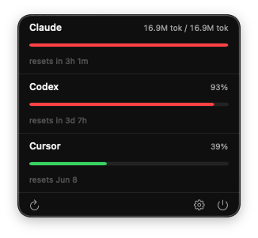

# AI Quota Tray

Native macOS menu bar app to track usage quotas across **Claude Code**, **Codex CLI**, and **Cursor**.

**Status:** MVP implemented — menu bar app with Claude, Codex, and Cursor quota rows.

## Screenshot



## Docs

| File | Purpose |
|------|---------|
| [docs/SPEC.md](docs/SPEC.md) | Product spec (MVP scope, data sources, UI) |
| [docs/MVP-PLAN.md](docs/MVP-PLAN.md) | Implementation plan and task checklist |
| [docs/BRAINSTORM.md](docs/BRAINSTORM.md) | Ideas backlog (v2 and beyond) |

## Decisions (locked for MVP)

- **Scope:** minimal — three provider rows, refresh on open + timer, no history DB
- **Stack:** SwiftUI + `MenuBarExtra`, macOS 14+, no third-party deps
- **Sandbox:** off for v1 (read `~/.claude`, `~/.codex`, Cursor cookie store)

## Build

```bash
# One-time: install xcodegen
brew install xcodegen

# Regenerate .xcodeproj after editing project.yml or adding files
xcodegen generate

# Build (ad-hoc, no signing required)
xcodebuild -project AIQuotaTray.xcodeproj -scheme AIQuotaTray \
  -configuration Debug build \
  CODE_SIGN_IDENTITY="" CODE_SIGNING_REQUIRED=NO

# Run directly from the build output
open ~/Library/Developer/Xcode/DerivedData/AIQuotaTray-*/Build/Products/Debug/AIQuotaTray.app
```

## First-run checklist

1. **Sign in** to Claude Code, Codex CLI, and Cursor on this Mac (tokens/logs are read locally).

2. **Cursor** — keep Cursor signed in; the app reads `cursorAuth/accessToken` from Cursor’s `state.vscdb` or Keychain.

3. **Launch at login** (optional) — enable in Settings (gear icon) in the tray popover.

## Project structure

```
AIQuotaTray/
  AIQuotaTrayApp.swift          entry point, MenuBarExtra scene
  Models/
    Provider.swift              enum: .claude | .codex | .cursor
    QuotaSnapshot.swift         value type returned by each provider
    QuotaStore.swift            @MainActor store, refresh loop
  Providers/
    QuotaProvider.swift         protocol
    ClaudeCodeProvider.swift    reads ~/.claude/projects/*/*.jsonl
    CodexProvider.swift         reads ~/.codex/sessions/…/*.jsonl
    CursorProvider.swift        state.vscdb / Keychain → DashboardService API
  UI/
    TrayContentView.swift       popover root (three rows + toolbar)
    QuotaRow.swift              single provider row with progress bar
    SettingsView.swift          refresh interval, launch-at-login
  Util/
    JSONLReader.swift           shared JSONL → [[String:Any]] helper
    ChromiumCookieReader.swift  SQLite + Keychain + PBKDF2 + AES-CBC
  Resources/
    Info.plist                  LSUIElement=YES (no Dock icon)
    AIQuotaTray.entitlements    sandbox off, network.client on
    Assets.xcassets
project.yml                     xcodegen spec
```
